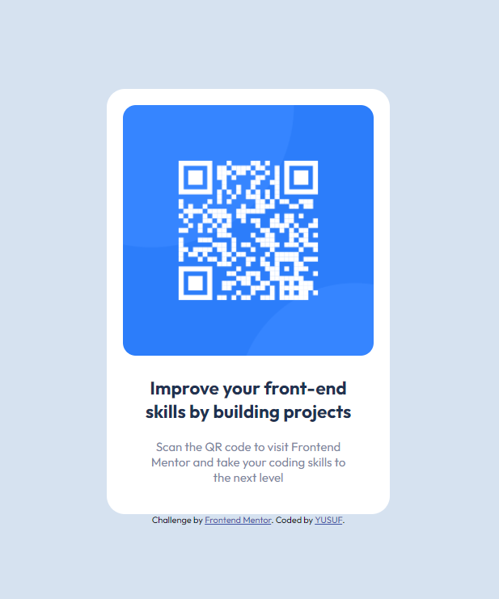

# Frontend Mentor - Profile card component  

This is a solution to the [QR code component challenge on Frontend Mentor](https://www.frontendmentor.io/challenges/qr-code-component-iux_sIO_H). Frontend Mentor challenges help you improve your coding skills by building realistic projects. 

## My process

### Built with

- Semantic HTML5 markup
- CSS custom properties
- Flexbox

### What I learned

I have learned how to allign items, texts, images and etc.
Implemented images to the index file
Added variables as colors to memorize and call them quickly when needed
Used justify, flex to allign items in order
Called the text from a link without needing to download it
Made it mobile friendly by marking the max width and the @media

```html
<h1>CSS Code</h1>
```
```css
@media only screen and (max-width: 500px) {
    .anayazi {
        width: 400px;
    }
}

:root {
    --arkaplan: hsl(212, 45%, 89%);
    --grimavi: hsl(220, 15%, 55%);
    --kapalimavi: hsl(218, 44%, 22%);
}

```

## Author

- Website - [Github](https://github.com/yildizyusuf)
- Frontend Mentor - [@yildizyusuf](https://www.frontendmentor.io/profile/yildizyusuf)
- Twitter - [@yolverenadam](https://www.twitter.com/yolverenadam)
